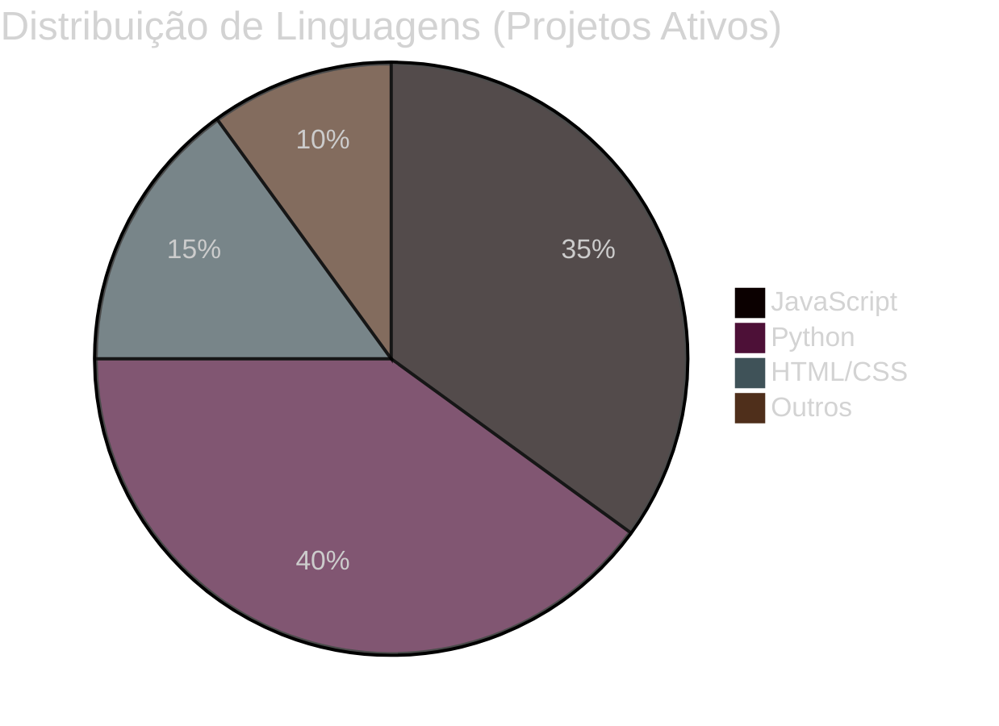

## 📊 GitHub Analytics & Performance Metrics  

### 🎯 Overview de Contribuições

  
  <picture>
    <source media="(prefers-color-scheme: dark)" srcset="https://github-readme-stats.vercel.app/api?username=devdavidejesus&show_icons=true&theme=tokyonight&include_all_commits=true&count_private=true&hide_border=true&bg_color=0d1117&title_color=58a6ff&icon_color=1f6feb&text_color=c9d1d9">
    
  </picture>
  
  <picture>
    <source media="(prefers-color-scheme: dark)" srcset="https://github-readme-stats.vercel.app/api/top-langs/?username=devdavidejesus&layout=compact&langs_count=8&theme=tokyonight&hide_border=true&bg_color=0d1117&title_color=58a6ff&text_color=c9d1d9">
    
  </picture>

---

### 🔥 Streak & Consistência de Commits

  <picture>
    <source media="(prefers-color-scheme: dark)" srcset="https://github-readme-streak-stats.herokuapp.com/?user=devdavidejesus&theme=tokyonight&hide_border=true&background=0d1117&ring=58a6ff&fire=f85149&currStreakLabel=58a6ff">
    
  </picture>

---

### 📈 Contribution Graph - Atividade Anual

  <picture>
    <source media="(prefers-color-scheme: dark)" srcset="https://github-readme-activity-graph.vercel.app/graph?username=devdavidejesus&theme=tokyo-night&hide_border=true&bg_color=0d1117&color=58a6ff&line=1f6feb&point=58a6ff&area=true&area_color=1f6feb">
    
  </picture>

---

### 🏆 Conquistas & Troféus Desbloqueados

  <picture>
    <source media="(prefers-color-scheme: dark)" srcset="https://github-profile-trophy.vercel.app/?username=devdavidejesus&theme=tokyonight&no-frame=true&no-bg=true&row=2&column=4&margin-w=15&margin-h=15">
    
  </picture>

---

### 💻 Código em Ação - Métricas Detalhadas

---

### 📊 Perfil de Atividade Semanal

  

---

### ⚡ Quick Stats - Performance Snapshot

| Métrica | Valor |
|---------|-------|
| 🎯 **Commits Totais** |  |
| ⭐ **Stars Recebidas** |  |
| 👥 **Seguidores** |  |
| 📦 **Repositórios Públicos** |  |

---

  
  ### 🎨 Visualizador de Perfil 3D (Opcional)
  
  
  
  *Animação das contribuições - atualizada automaticamente*

